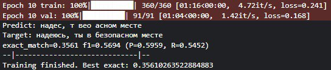
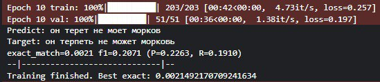
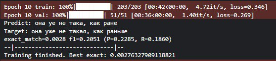
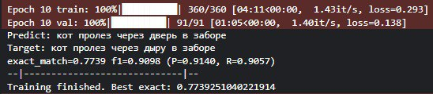
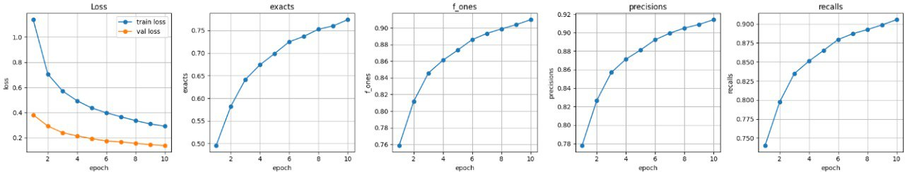
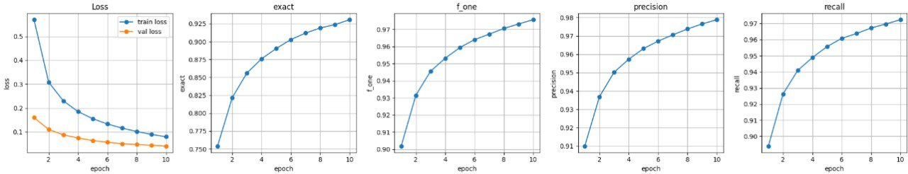
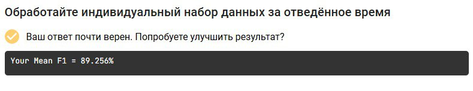

# Avito_DS_Internship
Китаев Степан, почта - kitaev.ste@yandex.ru

Ссылка на облако, с архивом с моделью - https://drive.google.com/drive/folders/1qYpUp19WosnXLnEuuXxWFwHWlBjz-ugp?usp=drive_link


Задание - разработать модель или алгоритм, который принимает на вход текст без пробелов и возвращает восстановленный текст с правильными пробелами и позициями, где они были пропущены.

# Датасет

В поисковую строку люди вводят некоторую фразу, с небольшим количеством слов, символов. В открытом доступе датасета с примерами фраз, которые были введены в поисквик найти не удалось, поэтому было принято решение использовать датасет фраз для обучения машинного перевода с английского на русский язык. Данный подход позволил использовать при обучении как русские фразы так и английские.


Ссылка на датасет на kaggle: https://www.kaggle.com/datasets/hijest/englishrussian-dictionary-for-machine-translate


Датасет состоял из 290 тысяч строк с переводом, то есть 290 тыс. русских фраз и 290 тыс. английских, в виду того, что submission файле мало слов на английском языке, то было принято решение оставить только 30 тыс. фраз. По итогу получается датасет, из 320 тыс. фраз. Ввиду ограничений по времени, в дальнейшем использовалось 50% датасета во время обучения модели и ее валидации. 


Принцип решения задачи - использование модели формат encoder-decoder или text-to-text. В качестве обучающей выборки модели подавались строки без пробельных символов, а на выходе необходимо получать эту же строку, но с пробелами.
```
янехочу,чтобытыобщаласьстомом -> я не хочу, чтобы ты общалась с томом
```

# Модель
В качестве решения было использовать модель формата text-to-text transfer transformer (T5). Для начала была взята доступная на kaggle без загрузки модель ```flan-t5 small 2``` 

## 1 эксперимент
Модель показала низкую точность, связано было было с тем, что модель корректно работала с анлийскими фразами, но допускала много ошибок на русских словах


## 2 эксперимент
Попытка обучить модель только на русских фразах также не дало положительных результатов


## 3 эксперимент
Модель формата flan - это модель работающая с инструкциями, поэтому было принято решение дать инструкцию к каждой фразе на входе, что также не дало результата


Инструкция ```("Correctly split a continuous phrase in Russian into separate words using spaces | " + phrase)```


## 4 эксперимент
Было принято решение изменить модель на предобученную fine-tuned модель T5-base с hugging face - ```cointegrated/rut5-base-multitask```. Данная модель была дополнительно преобразована для работы на двух языках - русском и английском путем удаления ненужных токенов из модели.



ссылка на страницу на hugging-face - ```https://huggingface.co/cointegrated/rut5-base-multitask```
Короткий эксперимент над этой моделью показал хорошие результаты (эксперимент с 5% от датасета)

Графики обучения на 10ти эпохах:


Поэтому было принято решение обучить модель на 50% датасета
В результате модель показала

``` accuracy при 100% совпадении индексов пробелов predict и target - 0.9337```

``` precision - 0.9789```

``` recall - 0.9713```

``` f1 - 0.9751```

``` loss_train - 0.0796```

``` loss_validation - 0.0441```

Графики обучения модели:



Результат на Stepik:



Также ссылка на ноутбук kaggle - https://www.kaggle.com/code/destee/avito-ds-internship/

Ускорение - стандарные ресурсы на kaggle - GPU P100 16гб

Спасибо за интересное задание, буду рад получить подробную обратную связь касательно моего решения.
